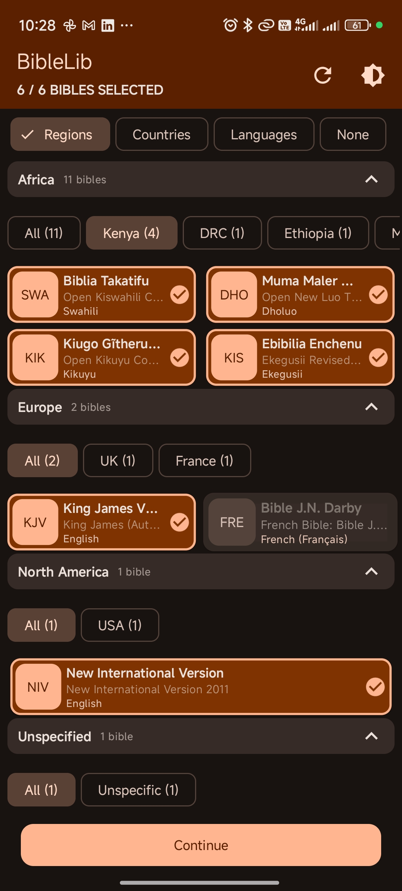
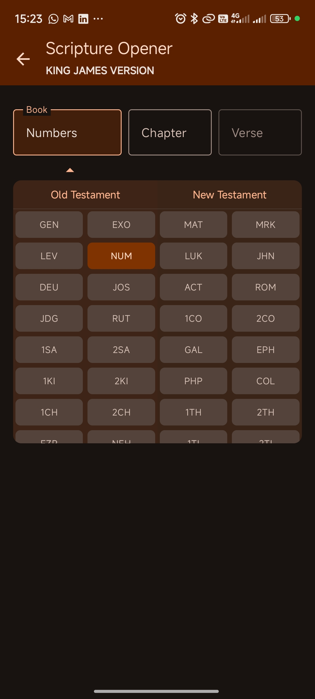
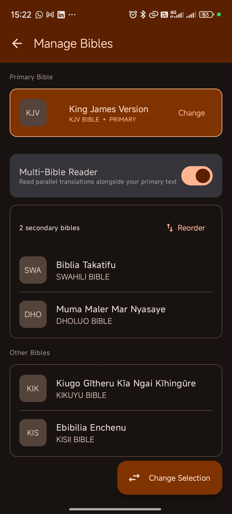
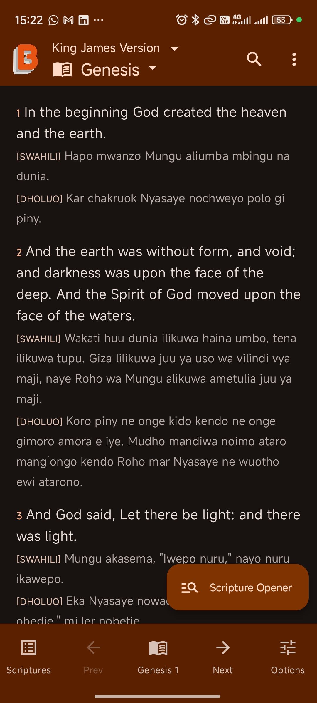

# BibleLib — Android

BibleLib is an open-source Bible reading app for Android. It gives users offline access to multiple Bible translations, a distraction-free chapter reader with a page-curl effect, full-text search, reading history, and adjustable font sizes and themes.

This guide covers everything you need to get the Android app built and running.

---

## Features

- **Multiple Bible translations** — browse and download translations from the BibleLib content API, one at a time
- **Offline reading** — once a translation is downloaded, its books, chapters, and verses are stored locally in Room and read entirely without internet access
- **Chapter reader** — book drawer and chapter navigation bar for quick jumps, with a page-curl swipe effect between chapters
- **Full-text search** — search verse text across a downloaded translation
- **Reading history** — automatically records recently read chapters and recent search queries, viewable and clearable from the History screen
- **Adjustable font size and theme** — light / dark / system theme, with a configurable reading font size
- **Donation support** — Paystack-backed donation flow (in-app WebView checkout) for supporting the project
- **Background downloads** — new translations download via WorkManager with a foreground progress notification, so the UI stays responsive
- **Crash and performance monitoring** — Sentry integration (breadcrumbs, performance traces, and optional screenshot/view-hierarchy capture on crash)

---

## Screenshots

<table>
  <tr>
    <td></td>
    <td></td>
    <td></td>
    <td></td>
  </tr>
</table>

---

## Table of contents

- [Tech stack](#tech-stack)
- [Prerequisites](#prerequisites)
- [Project structure](#project-structure)
- [Architecture overview](#architecture-overview)
  - [Module graph](#module-graph)
  - [Core modules](#core-modules)
  - [Feature modules](#feature-modules)
  - [Navigation](#navigation)
  - [Data flow and downloads](#data-flow-and-downloads)
- [Getting started](#getting-started)
  - [1. Clone the repository](#1-clone-the-repository)
  - [2. Create local.properties](#2-create-localproperties)
  - [3. Run the app](#3-run-the-app)
  - [4. Release builds (optional)](#4-release-builds-optional)
- [Contributing](#contributing)

---

## Tech stack

| Concern | Library / tool |
|---|---|
| UI | Jetpack Compose, Material 3 |
| Architecture | MVVM, multi-module Gradle |
| Dependency injection | Hilt |
| Local database | Room (schema version 4) |
| Networking | Retrofit 2 + OkHttp |
| Background downloads | WorkManager (Hilt-integrated worker) |
| Error & performance monitoring | Sentry |
| Payments | Paystack (donation flow) |
| Min SDK | 26 (Android 8.0) |
| Target / Compile SDK | 37 |

---

## Prerequisites

Before you start, make sure you have the following:

- **Android Studio** Hedgehog (2023.1.1) or newer
- **JDK 17** — required by the `build-logic` convention plugins
- **Android SDK** with API 26–37 installed (the SDK Manager inside Android Studio handles this)
- **A Paystack secret key** — only needed if you're working on the donation flow. The app builds and runs without it; the donation feature simply won't be able to initialize a transaction.

---

## Project structure

```
BibleLib/
├── app/                             # Application shell — entry point, navigation, top-level DI
│   └── src/main/java/com/biblelib/
│       ├── MainActivity.kt
│       ├── BibleLibApp.kt
│       ├── app/di/AppConfigModule.kt
│       └── app/navigation/AppNavHost.kt
│
├── build-logic/                     # Shared Gradle convention plugins (Hilt, Compose, library, feature)
│
├── core/
│   ├── common/                      # Routes, ApiConstants, PrefConstants, UiState, shared data classes — no Android deps beyond parcelize
│   ├── data/                        # Repositories, PrefsRepo, ThemeRepo, SyncWorker, SyncScheduler
│   ├── database/                    # Room database, all DAOs and entity models
│   ├── designsystem/                # Material 3 theme, colours, typography
│   ├── network/                     # Retrofit services, DTOs, NetworkModule
│   └── ui/                          # Shared Compose components (MainViewModel, AppTopBar, states, dialogs...)
│
└── feature/
    ├── selection/                   # First-launch / re-selection Bible picker
    ├── reader/                      # Chapter reader — book drawer, chapter nav, verse list
    ├── search/                      # Full-text verse search + recent search history
    ├── history/                     # Reading history
    ├── settings/                    # Theme, font size, app settings
    ├── donation/                    # Paystack donation flow + payment WebView
    └── help/                        # Help screen
```

---

## Architecture overview

### Module graph

Feature modules depend only on `core` modules and never on each other. All cross-feature navigation lives in `app`.

```
app
 ├── core:common
 ├── core:data          → core:database, core:network, core:common
 ├── core:designsystem
 ├── core:ui             → core:common, core:data, core:designsystem
 └── feature:*           → core:common, core:data, core:database, core:designsystem, core:ui
```

### Core modules

**`core:common`** — pure Kotlin/Parcelize. Holds `Routes` (all navigation route strings, including argument encoding for the reader and payment WebView), `ApiConstants`, `PrefConstants`, `AppFonts`, `UiState` (sealed interface: `Loading`, `Loaded`, `Saving`, `Saved`, `Error`), shared data classes (`BibleInfo`, `BibleBook`, `BibleChapter`, `VerseDisplay`, `ReadingHistory`, `SearchResult`), and `NetworkUtils`.

**`core:data`** — all data-access logic sitting above the DB and network layers:

- `PrefsRepo` — a strongly typed `SharedPreferences` wrapper covering install date, selected/primary Bible, last-read position, theme mode, font size, donation timestamp, last-sync timestamp, and `resetAppData()` for clearing selection state.
- `ThemeRepo` — a `@HiltViewModel` that exposes the current `ThemeMode` (`SYSTEM` / `LIGHT` / `DARK`) as Compose state and persists changes via `PrefsRepo`.
- `BibleRepo` — fetches available Bibles, books, chapters, and verses from the BibleLib content API, parses the nested verse-content JSON into flat `VerseDisplay` lists, and persists everything to Room. Also serves local reads and in-database verse search.
- `TrackingRepo` — records reading history and search-query history to Room, pruning old entries.
- `DonationRepo` — initializes a Paystack transaction (amount, donor email/name, callback URL) and returns the authorization URL for the in-app WebView checkout.
- `SyncWorker` / `BibleSyncWorkerFactory` / `SyncScheduler` — a Hilt-integrated `CoroutineWorker` that downloads a secondary Bible translation in the background with a foreground progress notification, scheduled via WorkManager with network constraints and exponential backoff.

**`core:database`** — Room database (`AppDatabase`, version 4) with six entities: `BibleEntity`, `BookEntity`, `ChapterEntity`, `VerseEntity`, `HistoryEntity`, `SearchEntity`, and their DAOs.

**`core:network`** — `NetworkModule` (Hilt) wires up two Retrofit instances: one for the BibleLib content API (`BibleLibService`, serving `info.json`, `books.json`, `chapters.json`, and per-book verse JSON) and one for the Paystack API (`PaystackService`, transaction initialization).

**`core:designsystem`** — Material 3 theme, colour palette, and typography scale.

**`core:ui`** — `MainViewModel` (determines the app's start destination) plus shared Compose components: `AppTopBar`, `EmptyState`, `ErrorState`, loading indicators, `DonationBanner`, `AppDialogs`, auto-sizing text utilities, `PageCurlEffect`, `CornerNavZone`, and `ThemeSelectorDialog`.

### Feature modules

| Module | Screens | ViewModels |
|---|---|---|
| `feature:selection` | Bible selection (first launch or re-selection) | `SelectionViewModel` |
| `feature:reader` | Chapter reader (book drawer, chapter nav bar, verse list, Bible selector sheet) | `ReaderViewModel` |
| `feature:search` | Verse search, recent search history | `SearchViewModel` |
| `feature:history` | Reading history | `HistoryViewModel` |
| `feature:settings` | Theme and font-size settings | `SettingsViewModel` |
| `feature:donation` | Donation screen, Paystack payment WebView | `DonationViewModel` |
| `feature:help` | Help | — |

All ViewModels are `@HiltViewModel`-annotated and follow the same pattern: `StateFlow` for UI state (observed with `collectAsState()` in the composable), coroutines on `viewModelScope` doing database/network work on `Dispatchers.IO`.

### Navigation

Navigation is handled by a single `NavHostController` in `AppNavHost.kt` at the `app` level. Route strings are constants in `Routes` (`core:common`); the reader route carries `bibleAbbr`, `bookId`, and `chapterId` as query arguments, and the payment WebView route carries a URL-encoded redirect URL.

`MainViewModel` determines the start destination at launch by reading `PrefsRepo`: if the user hasn't completed Bible selection (or asked to re-select), it routes to `SELECTION`; otherwise it routes straight to `READER`.

```
SELECTION ──► READER ──┬──► SEARCH
                        ├──► HISTORY
                        ├──► SETTINGS
                        └──► HELP
```

### Data flow and downloads

When a user selects a Bible in `feature:selection`, `BibleRepo.downloadBible()` runs the full fetch pipeline: books → chapters → verses (per book), converting the API's nested verse-content JSON into flat `VerseDisplay` rows and writing everything to Room. Selecting a second (secondary) translation later schedules the same download as a background job — `SyncScheduler.scheduleSecondaryDownload()` enqueues `SyncWorker` via WorkManager with a network constraint, exponential backoff, and a foreground notification that reports per-book download progress.

Once a translation is downloaded, `feature:reader` reads purely from Room — no network calls are needed to read, browse, or search within an already-downloaded Bible.

---

## Getting started

### 1. Clone the repository

```bash
git clone git@github.com:SiroDevs/BibleLib.git
cd BibleLib
```

### 2. Create `local.properties`

This file is gitignored. Create it at the project root (alongside `build-logic/`, `app/`, `core/`, `feature/`).

```properties
# Path to your Android SDK — Android Studio usually writes this automatically.
# If you open the project in Android Studio first, this line will already be here.
sdk.dir=/Users/yourname/Library/Android/sdk

# Optional — only needed if working on the donation feature
PAYSTACK_SECRET_KEY=your_paystack_secret_key_here
```

`app/build.gradle.kts` reads `PAYSTACK_SECRET_KEY` into a `buildConfigField`. If it's missing, the build still succeeds — the donation screen will just fail to initialize a transaction.

### 3. Run the app

Open the project in Android Studio. Gradle sync will run automatically. Once it completes, select the `debug` build variant and run the `app` configuration on a device or emulator running API 26 or higher.

```bash
# Or from the command line:
./gradlew :app:installDebug
```

The `debug` build variant uses the application ID `com.biblelib.dev`, so it installs alongside a production build without conflict.

On first launch the app walks through Bible selection, then downloads the chosen translation(s) from the live content API. You need a network connection for this initial download — after that, reading, browsing, and searching that translation work fully offline.

### 4. Release builds (optional)

Release signing is configured in `app/build.gradle.kts` and reads from a `keystore/key.properties` file. This is only needed if you are cutting a release build — **not required for development or contributing**.

Create `keystore/key.properties` at the project root:

```properties
storeFile=../keystore/release.jks
storePassword=your_store_password
keyAlias=your_key_alias
keyPassword=your_key_password
```

Then build:

```bash
./gradlew :app:bundleRelease    # AAB for Play Store
./gradlew :app:assembleRelease  # APK for direct install
```

---

## Contributing

1. Fork the repository and create a feature branch off `develop`.
2. New screens belong in a `feature` module. If you're adding a genuinely new section of the app, create a new feature module following the same `build.gradle.kts` structure as the existing ones.
3. Shared UI components go in `core:ui`. Logic that multiple features need goes in a repository in `core:data`.
4. All ViewModels must be `@HiltViewModel`-annotated. All repositories must be `@Singleton`-scoped.
5. Open a pull request with a clear description and reference any related issue.

For questions, open a GitHub issue.

**License:** MIT — feel free to use, modify, and distribute.